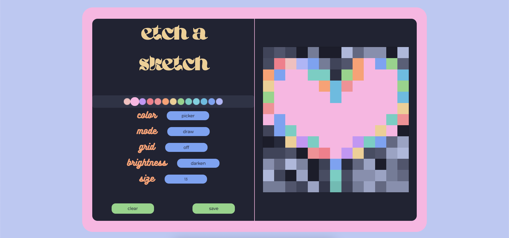

# **Etch-A-Sketch: Catppuccin**

This is a browser version of something between a sketchpad and an Etch-A-Sketch. This focuses on DOM manipulation with vanilla JavaScript.

### **Live Demo**
[Click here for a live preview of the site.](https://aquaryasss.github.io/etch-a-sketch/)

### **Features**

- Dynamic Grid Creation: Start with a default grid and use the size input to create a new grid of any size between 8x8 and 32x32 without refreshing the page.
- Click-and-Drag Drawing: The computer opponent is styled as Sheldon Cooper.
- Different Color Modes:
    - Random: Paints with a random, vibrant color from the beautiful Catppuccin color palette with every stroke.
    - Picker: Select a specific color from a dynamic on-screen Catppuccin color palette to draw with.
    - Moon: A monochromatic mode that draws with random shades of dark blue and gray.
- Primary Modes:
    - Draw: The default mode for applying color.
    - Erase: A fully functional eraser that resets squares to their default state, completely undoing any color or effects.
- Brightness Effects:
    - None: The default option for brightness mode. The color opacity is 1.
    - Darken: Progressively darkens a square by 10% with each pass, allowing for shading effects.  It doesn't do anything when the square has no base color. 
    - Lighten: Progressively lightens a square by 10% with each pass. Similarly, it doesn't do anything when the square has no base color yet. 
- Canvas Control:
    - Grid Toggle: Turn the grid lines on and off for a clean, seamless look.
    - Clear Button: Instantly clears the entire canvas, resetting all squares to their default state.
    - Save Button: Saves your work as `.png`. *To be implemented.* 

### **Technologies Used**

- HTML5: For the core structure of the application.
- CSS3: For all styling, including Flexbox layouts. 
- Vanilla JavaScript: For all event handling, and extensive DOM manipulation.

### **How to Run Locally**

1. Clone the repository:
```sh 
    git clone https://github.com/aquaryasss/etch-a-sketch.git
```  
2. Navigate to the project directory:
```sh 
    cd etch-a-sketch
```  
3. Open the `index.html` file in your web browser of choice.

### **Screenshots**


